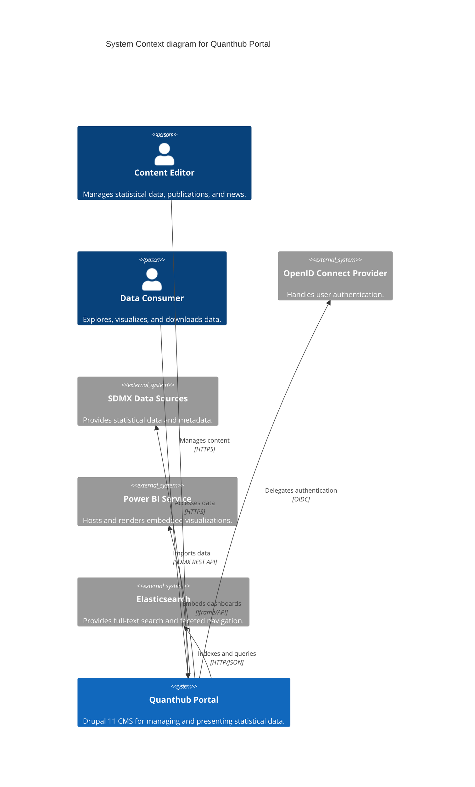
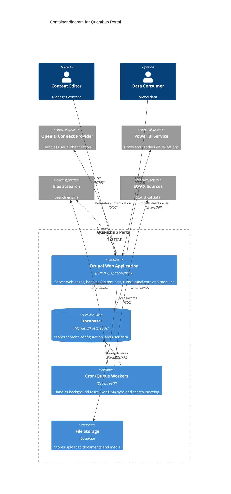
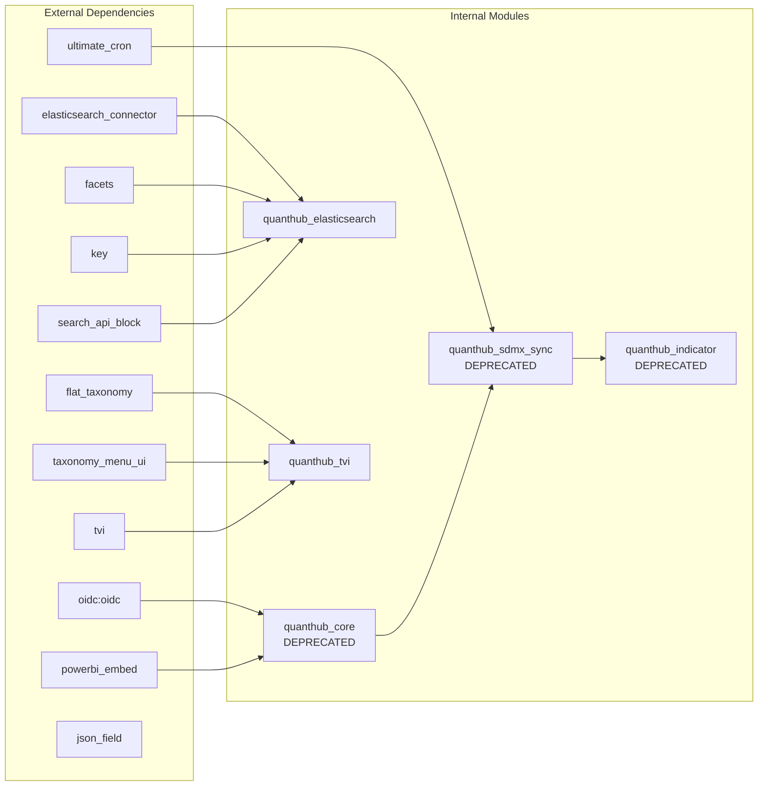
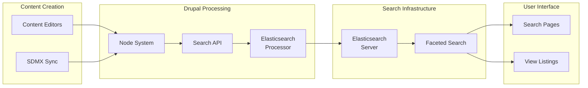
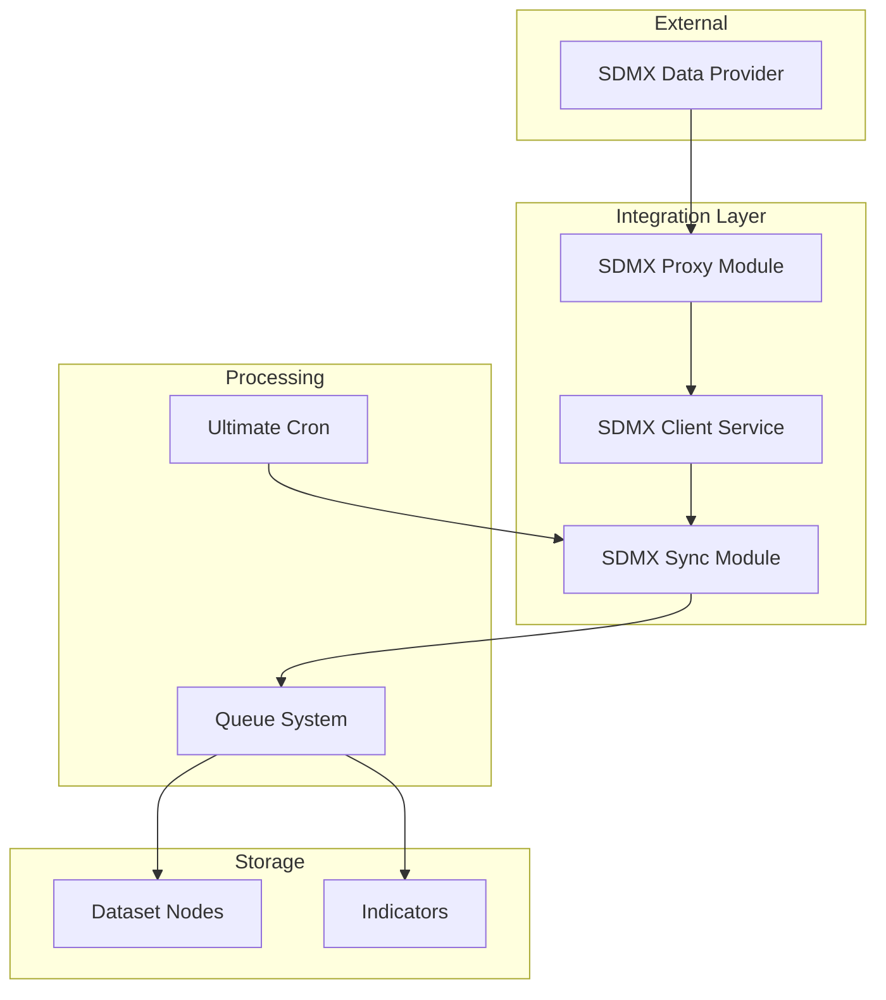
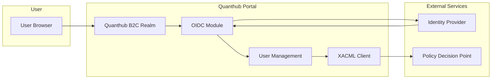
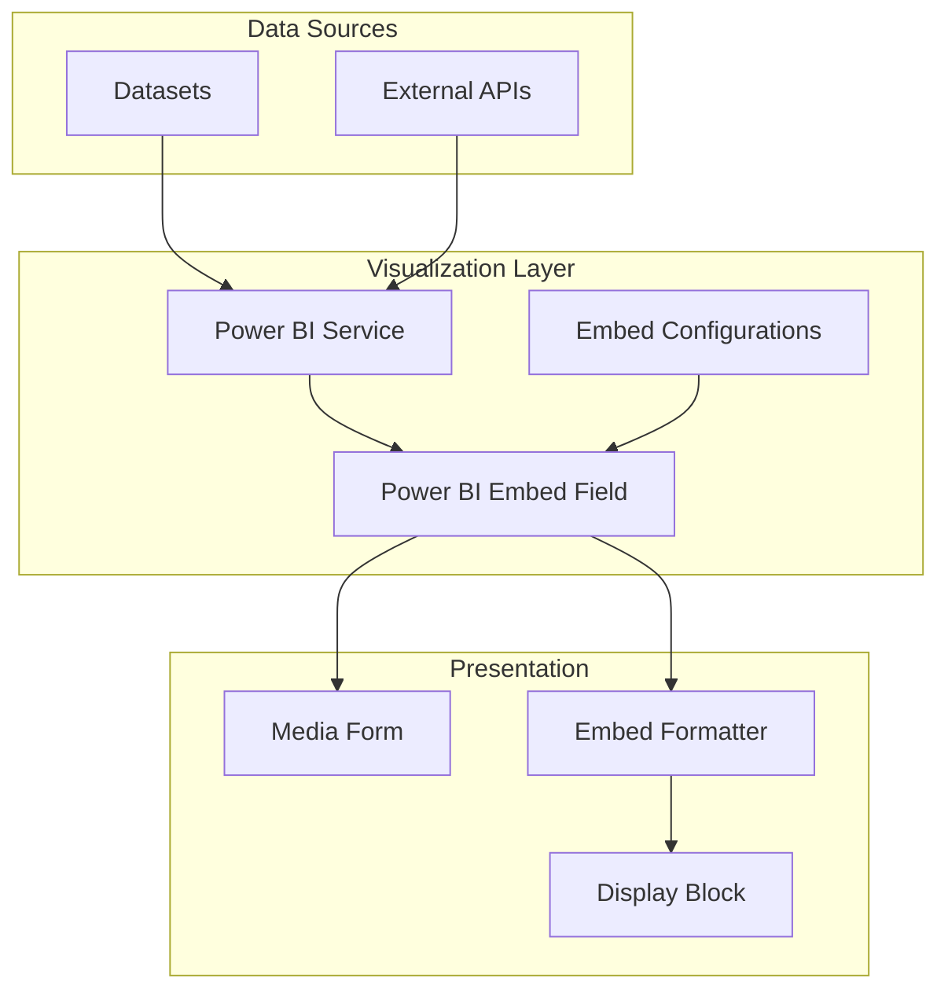
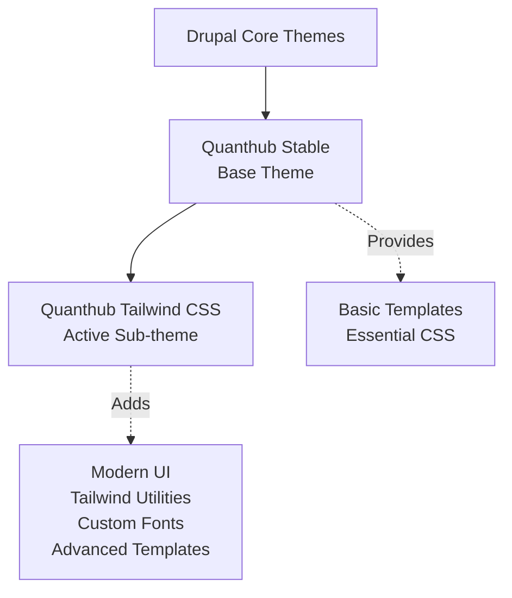

# Quanthub Portal Architecture

## Table of Contents

- [Overview](#overview)
- [Project Status](#project-status)
- [System Architecture](#system-architecture)
  - [System Context](#system-context)
  - [Container Architecture](#container-architecture)
- [Module Architecture](#module-architecture)
- [Content Model](#content-model)
- [Key Architectural Processes](#key-architectural-processes)
  - [Search and Discovery](#search-and-discovery)
  - [SDMX Data Integration](#sdmx-data-integration)
  - [Authentication and Authorization](#authentication-and-authorization)
  - [Visualization](#visualization)
- [Development & Operations](#development--operations)
  - [Local Development Setup](#local-development-setup)
  - [Configuration Management](#configuration-management)
- [Theme Architecture](#theme-architecture)

## Overview

Quanthub Portal is a Drupal-based statistical data portal designed for managing and presenting statistical data. The system integrates with SDMX (Statistical Data and Metadata eXchange) standard for data exchange and provides various tools for data exploration, visualization, and collaboration.

## Project Status

> **Current State**: The Quanthub Portal is in a transitional state, migrating from version 1.1.x to 2.0.x with significant architectural changes:
> - **Version**: 2.0.x-dev (development branch)
> - **Core**: Drupal 11 compatible
> - **Module Status**: Most feature modules are deprecated, indicating ongoing refactoring
> - **Active Development**: Focus on elasticsearch integration and taxonomy views
> - **Architecture Pattern**: Modular design with clear separation of concerns

> **Note on Deprecated Modules**: Modules marked as deprecated are maintained only for the legacy 1.1.x branch. The system is moving away from a large number of single-purpose UI and feature modules towards a more consolidated architecture. Core functionality is being centralized into key service modules like `quanthub_elasticsearch` and `quanthub_tvi`, reducing complexity and improving maintainability for Drupal 11.

## System Architecture

### System Context

The System Context diagram shows how the Quanthub Portal interacts with users and external systems. The portal serves as the central hub for statistical data management and presentation.

### Container Architecture

The Container diagram zooms into the Quanthub Portal to show its major runtime components. In the Drupal context, containers represent independently deployable or runnable parts of the system.

## Module Architecture

The portal's modular architecture separates concerns into focused components. Feature modules provide backend logic and API integrations, while UI modules offer user-facing blocks, pages, and render controllers. This separation allows for independent development and testing of different system aspects.

### Module Dependencies

The portal consists of 18 custom modules with various dependencies. The deprecation of most modules reflects an architectural consolidation strategy, moving from many single-purpose modules to fewer, more capable ones.

### Module Status

| Module | Status | Drupal Core Support |
|--------|--------|-------------------|
| quanthub_elasticsearch | Active | ^10 \|\| ^11 |
| quanthub_tvi | Active | ^10 \|\| ^11 |
| quanthub_core | Deprecated | ^9.5.2 \|\| ^10 |
| quanthub_sdmx_sync | Deprecated | ^9.5.2 \|\| ^10 |
| quanthub_indicator | Deprecated | ^9.5.2 \|\| ^10 |
| Other UI modules | Deprecated | ^9.5.2 \|\| ^10 |

## Content Model

The portal defines six main content types for organizing statistical data and related information. Each content type serves a specific purpose in the data publication workflow.

### Content Types

| Content Type | Machine Name | Description | Key Fields | Relationships |
|:-------------|:-------------|:------------|:-----------|:--------------|
| **Dataset** | `dataset` | Core entity for statistical data. Each dataset represents a collection of related statistical observations. | `field_quanthub_urn` (required), `field_topics` (ref: Taxonomy), `field_image` (ref: Media), `field_document` (ref: Media), `body` | Referenced by: Dashboard, Publication, Release |
| **Dashboard** | `dashboard` | Curated collections of datasets and visualizations for specific themes or topics. | `field_dataset` (ref: Dataset), `field_topics` (ref: Taxonomy), `body` | References: Dataset |
| **News** | `news` | Updates and announcements about data releases, methodology changes, or portal features. | `field_topics` (ref: Taxonomy), `field_image` (ref: Media), `field_document` (ref: Media), `body` | - |
| **Publication** | `publication` | Detailed reports and analyses based on statistical data. | `field_dataset` (ref: Dataset), `field_topics` (ref: Taxonomy), `field_image` (ref: Media), `field_document` (ref: Media), `body` | References: Dataset |
| **Release** | `release` | Time-stamped announcements of new or updated data availability. | `field_dataset` (ref: Dataset), `field_timestamp`, `field_topics` (ref: Taxonomy), `body` | References: Dataset |
| **Page** | `page` | Static informational pages such as methodology, help, or about sections. | `body` | - |

### Media Types

The portal supports various media types for rich content presentation:

- **Audio** - Audio files
- **Background** - Background images
- **Document** - Downloadable documents
- **Image** - Standard images
- **Remote Video** - Embedded videos

### Taxonomies

- **Topics** - Categorization for content
- **Media Directories** - Organization for media assets
- **Listings** - Used by TVI module for custom landing pages

## Key Architectural Processes

### Search and Discovery

To provide powerful and responsive search experiences, the portal offloads indexing and querying to an external Elasticsearch server. This architecture enables sub-second searches across millions of records with sophisticated filtering capabilities. Drupal's Search API module orchestrates the indexing of content, which is then made available to users through faceted search interfaces.

### SDMX Data Integration

SDMX (Statistical Data and Metadata eXchange) is an international standard for exchanging statistical data. The portal's SDMX integration enables automated consumption of statistical data from various national and international statistical organizations. The current implementation uses background jobs to periodically fetch and synchronize data, creating or updating `Dataset` nodes and their associated `Indicator` entities (a custom entity type for storing individual statistical metrics). The deprecated status of related modules suggests a new approach is being developed.

### Authentication and Authorization

The portal implements a sophisticated authentication and authorization system that goes beyond standard Drupal capabilities. Authentication is delegated to an external OpenID Connect provider through a custom B2C realm implementation, enabling single sign-on across multiple applications. Beyond Drupal's role-based access control, the system includes an XACML (eXtensible Access Control Markup Language) client for fine-grained policy-based access control on specific data elements, consulting an external Policy Decision Point (PDP) for complex authorization decisions. This check is invoked from custom Drupal access control hooks (e.g., `hook_entity_access`) to protect entities and fields based on the policies defined in the PDP.

### User Roles

The system defines several user roles:

- **Administrator** - Full system access
- **Content Editor** - Content management permissions
- **Authenticated** - Logged-in users
- **Anonymous** - Public access

### Visualization

The portal provides multiple visualization options to meet different user needs. Power BI integration enables embedding of sophisticated, interactive dashboards and reports created by data analysts. These visualizations can display complex statistical trends, comparative analyses, and real-time data updates. The integration is currently managed through the quanthub_core module, which handles authentication, embedding configuration, and display formatting.

## Development & Operations

### Local Development Setup

The portal requires the following components for local development:

- **PHP 8.2+** with required extensions
- **Database**: MariaDB 10.3+ or PostgreSQL 12+
- **Web Server**: Apache 2.4+ or Nginx 1.19+
- **Elasticsearch 7.x or 8.x** for search functionality
- **Composer 2.x** for dependency management
- **Drush 13.x** for Drupal CLI operations
- **Node.js 18+** and npm for theme development (Tailwind CSS compilation)

Developers typically use containerized environments (Docker/DDEV/Lando) to manage these dependencies consistently.

### Configuration Management

The portal uses Drupal's configuration management system with environment-specific overrides:

- **Config Install** - Base configuration deployed with the profile
- **Optional Config** - Additional features that can be enabled
- **Environment Variables** - Runtime configuration for services:
  - `ELASTIC_URL` - Elasticsearch endpoint
  - `ELASTIC_PREFIX` - Index prefix
  - `ELASTIC_USER` - Authentication username
  - `ELASTIC_PASSWORD` - Authentication password

## Theme Architecture

The portal provides two themes with a parent-child relationship:

- **Quanthub Stable**: Provides essential theming and base templates
- **Quanthub Tailwind CSS**: Modern theme built on Tailwind CSS framework, inheriting from Quanthub Stable while adding contemporary design patterns and responsive layouts